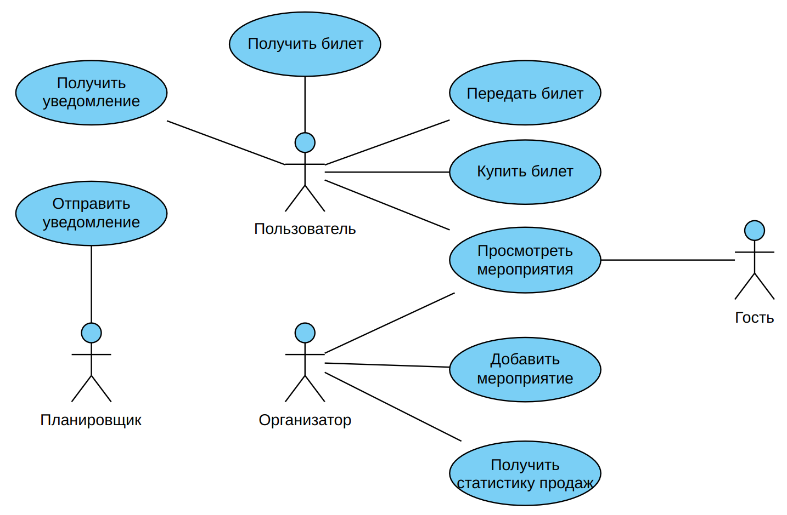
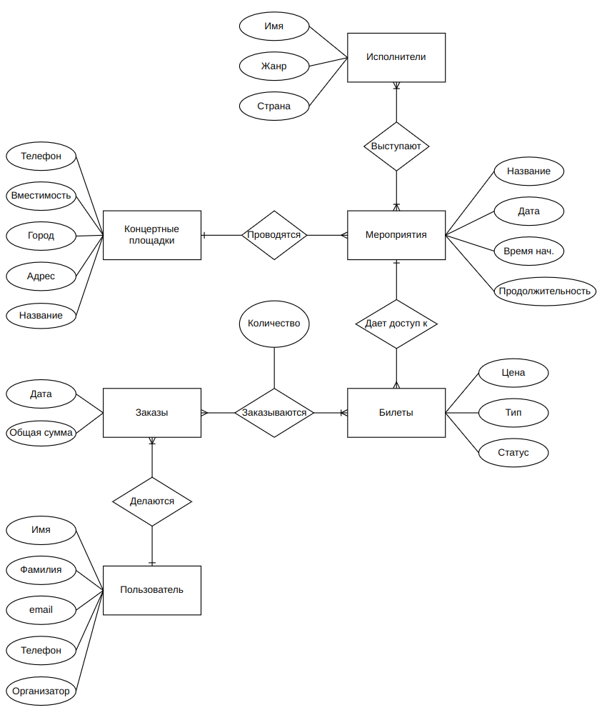
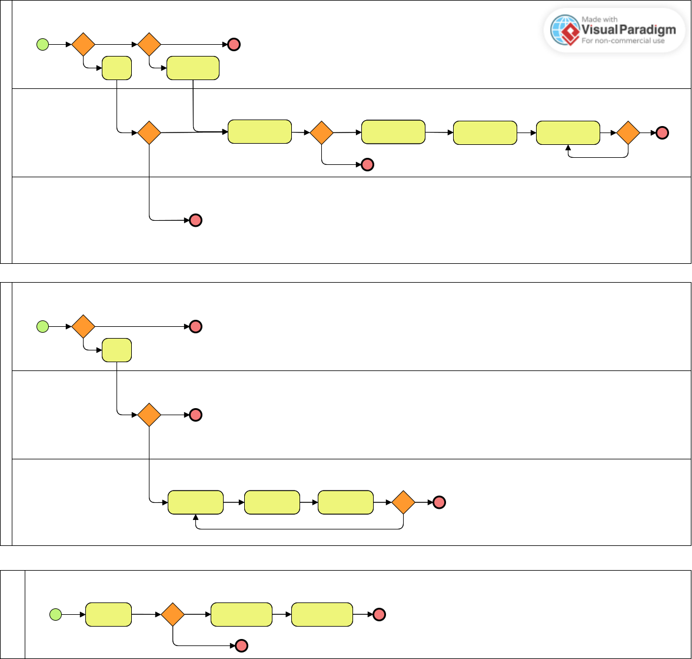

# Сайт по продаже концертных билетов

## Идея

Сайт будет представлять собой платформу для поиска концертов, фестивалей и других музыкальных мероприятий, покупки и продажи билетов на них. Пользователи смогут выбирать события по жанру, дате, артисту или локации. Платформа будет поддерживать оплату и электронные билеты.

## Описание предметной области

Предметная область включает в себя платформы для продажи билетов на различные мероприятия, такие как концерты, театральные постановки, спортивные события, фестивали и выставки. Эти сервисы предоставляют пользователям возможность поиска, покупки и управления билетами онлайн, а также предлагают дополнительные функции, такие как электронные билеты, предпродажи и выбор мест.

## Анализ анлогичных решений

| **Критерий**               | **Kassir.ru**                          | **Ticketland.ru**                     | **Yandex Афиша**                      | **Предлагаемое решение**
|----------------------------|----------------------------------------|---------------------------------------|---------------------------------------|--|
| **Электронные билеты**      | Да                                     | Да                                    | Да                                    |Да|
| **Передача билетов**        | Да (Ticket Transfer)                   | Нет                                    | Нет                                    |Да|
| **Уведомления о событиях**  | Нет                                     | Нет                                    | Да (интеграция с Яндекс.Почтой)       |Да|
| **Поддержка нескольких языков** | Нет (только русский)                | Нет (только русский)                  | Нет (только русский)                  |Да|

## Целесообразность и актуальность проекта

Разработка сайта целесообразна, так как проект предлагает уникальные преимущества: поддержка нескольких языков, уведомления и передача билетов. Эти функции отсутствуют у конкурентов, что делает сервис более удобным и привлекательным для пользователей.

## Акторы (роли)

0. **Гость (Неавторизованный пользователь)**
    - Просмотр мероприятий

1. **Пользователь (Покупатель)**  
   - Поиск мероприятий, покупка билетов, управляет ими (передача).  
   - Получение уведомления о событиях.  

2. **Организатор мероприятий**  
   - Создание событий, управление билетами.  
   - Получение статистики продаж. 

3. **Планировщик**
    - Механизм отслеживания грядущих мероприятий, отправляющий уведомления.

## Use-case диаграмма

## ER диаграмма

## Пользовательские сценарии

---

### **Сценарий 0: Гость (Неавторизованный пользователь) — Просмотр мероприятий**
1. **Открытие платформы**:  
   - Гость заходит на сайт или в мобильное приложение.  
2. **Поиск мероприятий**:  
   - Использует фильтры (дата, жанр, город) для поиска интересующих событий.  
3. **Просмотр информации**:  
   - Открывает страницу мероприятия, чтобы узнать подробности (дата, место, цена билетов).  
4. **Регистрация или переход к покупке**:  
   - Если гость решает купить билет, его перенаправляют на страницу регистрации или авторизации.  

---

### **Сценарий 1: Пользователь (Покупатель) — Покупка билета и передача его другу**
1. **Авторизация**:  
   - Пользователь входит в свой аккаунт.  
2. **Поиск мероприятия**:  
   - Использует поиск или фильтры для нахождения нужного события.  
3. **Выбор билета**:  
   - Выбирает количество билетов и места (если доступна интерактивная карта зала).  
4. **Оплата**:  
   - Оплачивает билеты через доступные способы оплаты.  
5. **Передача билета**:  
   - В личном кабинете выбирает опцию "Передать билет", указывает email или номер телефона друга.  
6. **Уведомление**:  
   - Друг получает уведомление о передаче билета и инструкции по его использованию.  

---

### **Сценарий 2: Организатор мероприятий — Создание события и просмотр статистики**
1. **Авторизация**:  
   - Организатор входит в свой аккаунт.  
2. **Создание мероприятия**:  
   - Заполняет форму с данными о событии (название, дата, место, описание, цены на билеты).  
3. **Публикация**:  
   - После модерации мероприятие публикуется на платформе.  
4. **Просмотр статистики**:  
   - В личном кабинете организатор видит количество проданных билетов, выручку и другую аналитику.  
5. **Управление билетами**:  
   - При необходимости организатор может изменить количество доступных билетов или цены.  

---

### **Сценарий 3: Планировщик — Отправка уведомлений о грядущих мероприятиях**
1. **Сбор данных**:  
   - Планировщик автоматически анализирует базу данных мероприятий, чтобы определить события, которые скоро начнутся.  
2. **Фильтрация по интересам**:  
   - Система выбирает пользователей, которые ранее интересовались похожими мероприятиями.  
3. **Формирование уведомлений**:  
   - Создаются персонализированные сообщения с информацией о мероприятии (дата, место, ссылка на покупку).  
4. **Отправка уведомлений**:  
   - Уведомления отправляются через Telegram-бота, email или push-уведомления в приложении.  
5. **Логирование**:  
   - Система фиксирует, какие уведомления были отправлены и насколько они были эффективны (открытия, переходы).  

## Формализация ключевых бизнес-процессов

